<center><font size=7 face="思源宋体"><b> 计 算 机 控 制 实 验 </font></center></centerb>

---

| 姓名   | 班级      |
| ------ | --------- |
| 何千越 | 自动化 84 |
| 张安驰 | 自动化 82 |
| 左梓辰 | 自动化 84 |


<center> 2021.06.18 </center>


​	


---

<center><b><font size = 6 face = "微软雅黑">MyRIO小车传感器模块报告</font></b></center>

---

## I.遥控控制模块

### 1.1 硬件原理 & 电路连接

​		三轮小车是由1个小脚轮（万向轮）和2个电机分别驱动的2个动力轮组成 的差动驱动小车，如图1和图2所示。小车的两个动力轮的电机采用JGA25-370- 21直流电机，驱动电压为6V，最高转速281rpm。对小车的各种运动控制实质上是对2个电机转速的控制，电机需要连接电机驱动电路。

|           小车            |                             电机                             |
| :-----------------------: | :----------------------------------------------------------: |
| 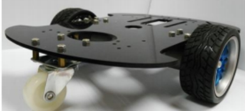 | 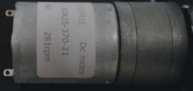 |

​		NI myRIO的输出信号无法直接驱动小车的电机旋转，因此需要外加电机驱动电路。驱动电路的基本组成构件包括或非门74F02N和H-桥TA8428K，在面包板上搭建电路。根据驱动电路的工作原理，利用NImyRIO的数字输入输出端口输出的PWM波形，实现对小车电机的驱动。

#### 1.1.1 H-桥TA8428K 

​		H-桥的外观图及基本原理图如图3所示，真值表如图4所示。根据H-桥的工作原理，可以设计出其基本的应用电路，如图5所示。 

| 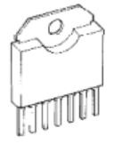 | 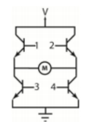 | 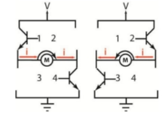 |
| ------------------------- | ------------------------- | ------------------------- |
| 外观图                    | 电路图                    | 电路控制原理              |

<center><font size = 2>Figure 1. H-桥外观图及基本原理图</font></center>

 

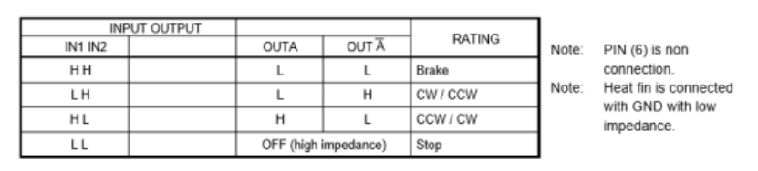 

<center><font size = 2>Figure 2. TA8428K 真值表</font></center>

 

#### 1.1.2 或非门74F02N 

​		在电机驱动电路中，需要将NImyRIO的输出信号经过一定逻辑运算后输入到 H-桥的输入端，以此实现 H-桥对电机的驱动以及方向控制。这一系列逻辑运算采用或非门实现。74F02N共有14个端口，其7号管脚为接地端，14号管脚为电源端，剩余12个管脚每3个分为一组，两个输入，一个输出，实现或非逻辑运算。而在本次实验中，只用到了三组或非门，因此74F02N有三个管脚置空。 

#### 1.1.3 电机驱动电路 

​		电机驱动电路的组成如图7所示，由H桥和3个或非门组成。其中，或非门74F02N的供电电压为+5V，而H-桥TA8428K的供电电压为+12V。从或非门模块输入PWM信号，由它的频率和占空比决定电机的驱动电压，即对速度的控制，另外还需要引入一个布尔变量，输入到或非门模块的D0端口，用于控制电机的转向，从而使小车能够实现直行，倒车。而当小车的两轮转速不同时，小车就实现了转弯。本实验就是按照下图进行电路的连接。

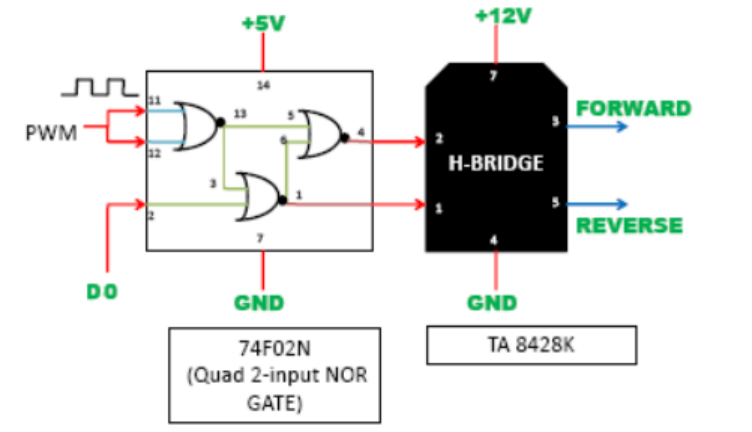

<center><font size = 2>Figure 3. 电机驱动电路</font></center>

### 1.2 逻辑说明

#### 1.2.1 总体思路

​		在电脑端，可以在LabVIEW中利用myRIO模块的数字输入输出端口输出PWM信号，将PWM信号输入到电机驱动电路中，最后由H-桥的输出电压驱动电机转动。将这个过程简化，可以看做是用myRIO输出的PWM信号以及额外的数字信号来控制电机的转速和转向。因此，在遥控控制中，只需要完成PWM信号和数字量信号的输出，即可实现对小车的控制。另外，由于两个电机并不是完全相同的，因此为了小车能够精确地前进或倒退，在程序中还需要考虑到两轮转速差的补偿。

#### 1.2.2 具体设计思路

​		程序框图设计完成后，将所有变量设置为共享变量，以转移到iPad上进行控制。连接NImyRIO后，先利用NI MAX查询NImyRIO的信息，再使用iPad连接myRIO发出的WIFI网络。在Data Dashboard中新建项目，再新建出控制模块中的开关或滑动条，加以文本说明，找到之前设置好的共享变量库，将两者连接起来，确定项目中每个变量对应电脑端程序中的哪个变量。之后改动变量的幅值范围，调节参数时拖动至合适的位置即可。 

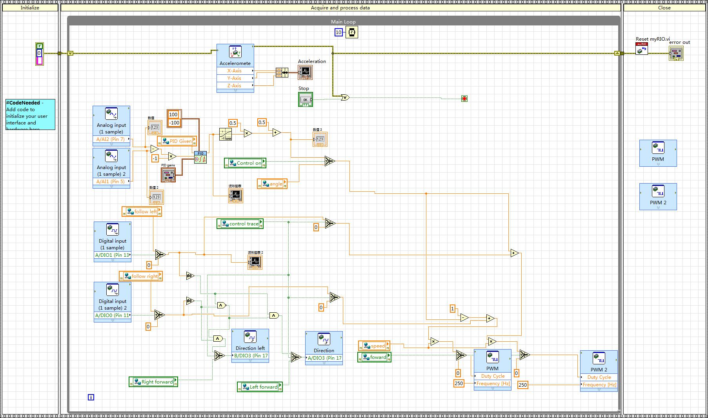

<center><font size = 2>Figure 4. 遥控 循光 循迹三部分程序框图</font></center>

​		遥控部分实际上只有一个简单的方向控制和轮转动控制。由于小车 / MyRIO每次都是不固定的，需要重装，也就是说：**<u>依靠小车加速度传感器标定（去畸变结果），控制小车直行是不可能的</u>**。只能手动控制。而我们的控制方法很简单：依靠一个模拟输入（共享变量angle）：
$$
\begin{align}
& V_l=aV_{pwm}\\
& V_R=(1-a)V_{pwm}
\end{align}
$$
​		左右轮有一个基准速度$V_{pwm}$，这是由占空比直接确定的。而angle为上式的变量$a$，可以看出，当a=0.5（控制面板滑动条拉至中间位置时），小车左右轮速一致，直行。拉至左边（a->0），左轮轮速为0，右轮加速，左转。反之右转，可以看出前面板的控制与人的习惯是一致的。

### 1.3 问题与解决

​		在实验过程中，一个主要遇到的问题是进行直行补偿的调试时（包括前进和后退），无论怎么调整都很难走直，甚至会出现“S”型的路线，即电机的转速在占空比不变时并不稳定，这一现象导致难以继续调整。在实验中，最终不得已更换了小车，更换后，这一现象不再出现，很快就完成了参数的整定。据此推测是原来的小车上的电机工作状态不稳定。实际上，较为理想的情况是小车的左右电机的状况、新旧程度都相似，这样才最容易进行参数整定，小车的运动情况也稳定。

### 1.4 结果简要展示

遥控控制做到了控制小车的直行，倒退，转弯，8字和U型，以下列出几张实验结果视频的截图。

| 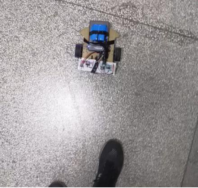 | 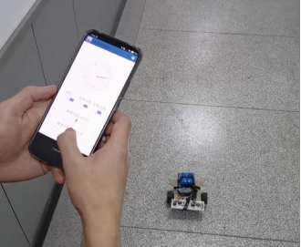 |
| :-----------------------: | :------------------------: |
|         小车样式          |       远程前面板控制       |

---

## II. 循光PID控制模块

### 2.1 硬件原理 & 电路连接

​		光电二极管（也称光敏二极管）是将光信号变成电信号的半导体器件，是在反向电压作用之下工作的。它的核心部分也是一个PN结，和普通二极管相比，在结构上不同的是，为了便于接受入射光照，PN结面积尽量做的大一些，电极面积尽量小些，而且PN结的结深很浅，一般小于1微米。 

​		光电二极管没有光照时，反向电流很小（一般小于0.1微安），称为暗电流。当有光照时，携带能量的光子进入PN结后，把能量传给共价键上的束缚电子，使部分电子挣脱共价键，从而产生电子-空穴对，称为光生载流子。

​		光生载流子在反向电压作用下参加漂移运动，使反向电流明显变大，光的强度越大，反向电流也越大，这种特性称为“光电导”。光电二极管在一般照度的光线照射下所产生的电流叫光电流。如果在外电路上接上负载，负载上就获得了电信号，而且这个电信号随着光的变化而相应变化。 

​		光敏传感器模块工作电压为+5V，具有数字量电平信号和模拟量电平信号输出，在使用过程中，可以根据需要，选择数字量电平信号或模拟量电平信号。

​		光敏传感器的电路原理图如图所示。当光敏二极管接收到光信号后，光敏二极管的电阻减小，电流变大，AC节点电压被拉低为低电平信号；相反，没有光照射时，光敏二极管呈现极高阻值，AC节点电压被上拉为高电平信号。模拟量电平信号输出由AC电平决定，由此可以判断光信号。 

​		虽然模拟量电平信号能够迅速判断光照信号，但容易受到环境的干扰，比如日光等。通常将模拟量电平信号和指定的阀门电压值（由IN信号决定）进行比 较后，将结果OUT信号输出。因此，在使用数字量电平信号输出时，应首先调整阀门电压值。 实际MyRIO电路连接只有左右两个模块的模拟输出需要连接到MyRIO模拟输入口上。

<table>
    <tr>
        <td>VCC：工作电压+5V </td>
        <td rowspan="4"><center></center></td>
    </tr>
  	<tr>
    	<td>GND：电源地 </td>
  	</tr>
    <tr>
    	<td>DO：数字量电平信号输出 </td>
  	</tr>
    <tr>
    	<td>AO：模拟量电平信号输出 </td>
  	</tr>
</table>

### 2.2 逻辑说明

​		主要分为三块：

| 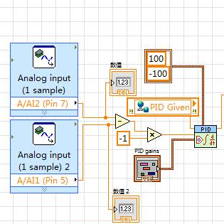 | 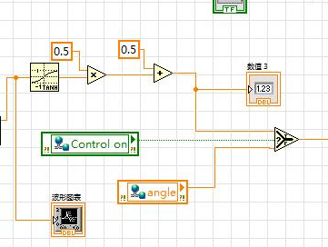 | 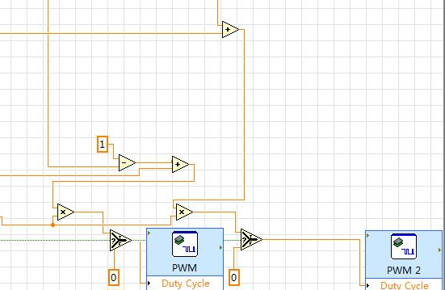 |
| :------------------: | :------------------: | :---------------------------------------------: |
| 光敏输入差分PID控制  |        重映射        |                复用遥控逻辑控制                 |

#### 2.2.1 差分PID控制

​		一个光敏电阻无法完成（**<u>可以，但是十分麻烦。控制效果不会好的</u>**）循光控制（因为无法确知光源方向）。当有两个模拟输出的光敏传感器时，可以通过比较左右两个光敏传感器谁的输出电压低（低说明电阻小，电阻小说明光强）判断强光源在何处。

​		首先输入做差，得到差分值。如果希望光源在正前方，那么差分值应该为0（当理想情况下，传感器一致时）而如果不为零当然要进行控制，期望的控制效果就是：光源在正前方，差分输出为0。

​		这个PID调起来并不麻烦，实际上是个PD调节。因为无法做到无稳态误差（本身传感器就不是相同的属性，会有零偏）。

#### 2.2.2 重映射 & 输出复用

​		本身想使用公式$\eqref{sig}$来进行重映射，但是发现MyRIO没有这个函数，自己搭没有用tanh方便：
$$
\begin{align}
& \text{sigmoid}(x)=\frac 1{e^{-x}+1}\label{sig}\\
& \tanh(x)=\frac {e^{x}-e^{-x}}{e^{-x}+e^{x}}
\end{align}
$$
​		重映射是为了复用遥控模块中的轮速控制。angle需要在[0,1]区间内，所以需要让PID输出在[0,1]区间内。又由于不能截断，最好是使用带有饱和特性（输入无界，输出有界）的函数进行映射。故选择tanh。但是tanh值域为(-1,1)，所以需要化为$0.5\tanh(x) + 0.5$即可。

​		那么只需输出到angle（再外加一个布尔共享变量，控制何时开启循光，即可切换自动循光angle，以及手动的前面板设定angle）

### 2.3 问题 & 说明

#### 2.3.1 遇到的问题

​		本模块较为简单，但是还是碰到一个小问题：**<u>传感器不一致</u>**。开始时，有一个光敏传感器的0位不一致，我们本以为是暗电流的原因，但是发现环境光并不影响，则说明是传感器本身的问题。

​		这很难办，零位不一致加上值域不同 / 灵敏度不同，直接导致PID差分输入不适合作为当前输入（无法设定给定量以满足要求）。开始试着调整给定输入，但是效果不好。

​		最后更换了其中一个光敏元件，使得左右两个光敏传感器的性质类似，才取得较好的效果。

#### 2.3.2 优越性

​		相比起其他一些小组来说，本小组实现的循光是无需在弱光条件下进行循光的，环境光对循光效果没有影响。原因如下：

- 环境光是漫射光，空间光强几乎一致，传感器左右两端接收的光也类似
- PID差分输入，差分效应使得环境光引起的电压作为基底电压已经被减去了。

### 2.4 简要效果展示

| 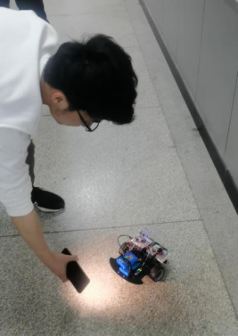 | 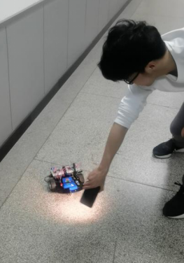 |
| :----------------------------------------------------------: | :----------------------------------------------------------: |
|                   环境光下的循光控制（1）                    |                   环境光下的循光控制（2）                    |

---

## III. 红外循迹

### 3.1 硬件原理 & 电路连接

​		本节将按顺序介绍所使用的传感器的特性和传感器实物如何连接。

#### 3.1.1 传感器特性

<table>
    <tr>
        <td>VCC：工作电压+5V </td>
        <td rowspan="4"><center></center></td>
    </tr>
  	<tr>
    	<td>GND：电源地 </td>
  	</tr>
    <tr>
    	<td>DO：数字量电平信号输出 </td>
  	</tr>
    <tr>
    	<td>AO：模拟量电平信号输出 </td>
  	</tr>
</table>

​		该传感器有四个引脚，如表1所示，分别是VCC、GND、DO和AO。VCC和GND是供电引脚，DO是数字输出引脚，AO是模拟输出引脚。

​		该传感器有一对红外发射与接受管。发射管发射出一定频率的红外线，当检测方向有障碍物(反射面)时，红外线反射回来被接收管接收，经过比较器电路处理之后输出信号。输出的信号与接收的红外线强度有关。

​		输出的信号有数字输出和模拟输出两种。

​		根据接收到的红外线强度高低，数字输出引脚DO输出高电平或低电平，实测发现，当传感器下方为黑色线条时，DO端输出高电平，否则为低电平。根据检测到的距离不同，模拟输出引脚AO的电压不同。

#### 3.1.2 传感器实物连接

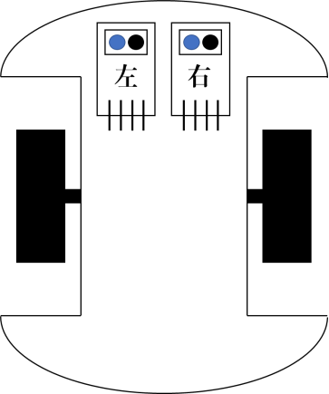

<center><font size = 2>Figure 5. 传感器实物安装示意图</font></center>

​		本次实验使用了两个红外寻迹传感器，关于中轴线对称，一左一右地安装在车前端，红外发射与接受管朝正下方地面，示意图如图2所示。以左侧为例，当左侧传感器检测到黑线时，代表整个车体朝向偏右，此时MyRIO控制车体朝左旋转，即可使车体回归正确轨迹。

​		两个传感器的VCC和GND分别连接MyRIO的VCC和GND即可，数字输出引脚DO分别连接到MyRIO的两个数字输入IO端口。在本实验中不使用传感器返回的模拟信号，因而模拟输出引脚AO空置。

### 3.2 算法逻辑迭代

​		本节会按照实验过程中算法的逐步迭代过程介绍实现寻迹功能的控制逻辑。基本思想是根据左右传感器返回的数字信号判断车体相对于轨迹偏左还是偏右，进而调节轮速或直接转变车轮旋转方向，使得车体回归正确轨迹。

#### 3.2.1第一版逻辑—单轮减速

<center> </center>

​		最初使用的逻辑方案思路为：当某个传感器检测到黑线时，控制同侧车轮减速，引起的差速使得车体向该侧旋转，使车体回归正确轨迹。

​		具体的逻辑控制对应关系如表2所示。当两传感器都未检测到黑线时，车体正常前进，转速不变。当某一侧传感器检测到黑线时，MyRIO控制同侧车轮减速。

​		以车体左传感器检测到黑线、右传感器未检测到为例。此时车体朝向偏右，左传感器数字输出端返回高电平“1”，右传感器数字输出端返回低电平“0”。MyRIO在与传感器数字输出端相连的IO口读到相应电平后，降低左轮PWM波的占空比，使左轮减速，以期车体向左旋转，回到正确的方向。

​		实测遇到了较大问题，车体完全无法实现转向，在应该转弯的位置继续向前行走，越过轨迹。

​		分析认为，单轮减速造成的差速过小，车体无法在短时间内完成转向。当车体凭惯性越过轨迹后，传感器也不再返回正确信息，车体停止转向，彻底无法回归正确方向。

​		解决思路为增大差速，考虑到程序修改的便捷性，尝试通过增大另一侧车轮的转速来达到增大差速的目的，因而得到了第二版逻辑。

#### 3.2.2 第二版逻辑—一轮减速，另一轮加速

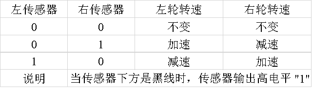

​		改进后的逻辑关系如表3所示。当两侧传感器都未检测到黑线时，车轮转速不变。当一侧传感器检测到黑线时，MyRIO控制同侧车轮减速，另一侧车轮加速。

​		以车体右传感器检测到黑线、左传感器未检测到为例。此时车体朝向偏左，右传感器数字输出端返回高电平“1”，左传感器数字输出端返回低电平“0”。MyRIO在与传感器数字输出端相连的IO口读到相应电平后，降低右轮PWM波的占空比，使右轮减速，提高左轮PWM波的占空比，使左轮加速，以期车体向右旋转，回到正确的方向。

​		实测时发现，在较缓的弯道处，车体可以正常过弯。但在较急的弯道处车体无法正常转向，依然在应该转弯的位置继续向前行走，越过轨迹。

​		分析认为，一轮减速，另一轮加速的控制逻辑造成的差速依然不能满足要求。差速不够，车体就无法在短时间内完成转向。当车体凭惯性越过轨迹后，传感器也不再返回正确信息，车体停止转向，彻底无法回归正确方向。

​		解决思路为换向，直接更改同侧车轮的旋转方向，以达到进一步增大差速的目的，从而得到了第三版逻辑。

#### 3.2.3 第三版逻辑—一轮反转


​		改进后的逻辑关系如表4所示。当两侧传感器都未检测到黑线时，车轮转速不变，旋向也不变。当一侧传感器检测到黑线时，MyRIO控制同侧车轮反转，另一侧车轮加速。

​		以车体左传感器检测到黑线、右传感器未检测到为例。此时车体朝向偏右，左传感器数字输出端返回高电平“1”，右传感器数字输出端返回低电平“0”。MyRIO在与传感器数字输出端相连的IO口读到相应电平后，控制左轮反转，同时增大右轮PWM波的占空比，使右轮加速，以期车体向左旋转，回到正确的方向。

​		实测时发现，在较缓或较急的弯道，车体都可以正常过弯。但在交叉轨迹处，车体会出现向后运动，无法继续前进的现象。

​		分析表4可以看出，当两传感器都检测到黑线时，MyRIO会控制两车轮都反转，使得车体向后运动。当车体后退至两传感器都检测不到黑线时，MyRIO控制车体重新向前，这样就又会出现两传感器都检测到黑线的情况。最终陷入死循环，车体不停抖动，无法前进。

​		解决思路为添加额外的逻辑运算，使得两传感器都返回高电平时，MyRIO控制两车轮继续正转，从而得到了第四版逻辑。

#### 3.2.4 第四版逻辑—一轮反转+额外逻辑运算

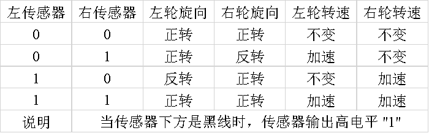

​		改进后的逻辑关系如表5所示。与表4相比，只有左右传感器都返回高电平“1”时的情况有所不同。通过在程序中添加的逻辑运算，在这种情况下，MyRIO仍旧会控制两车轮正转，使得车体越过交叉路口。

​		实测发现，这一版逻辑可以达到使用目标，解决了交叉路口无法前进的问题，拍摄的视频通过了验收。

​		下面将通过程序框图，分模块地介绍具体的逻辑。

### 3.3 程序框图

#### 3.3.1 共享变量介绍

<center>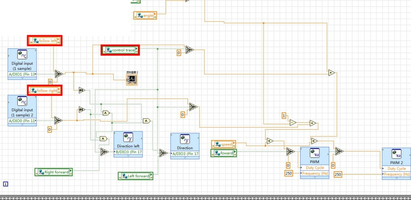 </center>

<center><font size = 2>Figure 6. 寻迹功能整体逻辑框图</font></center>

​		寻迹功能相关的逻辑框图如图3所示。下面会分转速控制与反转控制介绍逻辑，现在先介绍相关的共享变量。主要的共享变量已经在图3中由红色方框圈出，分别是“follow left”、“follow right”、“control trace”。其中“follow left”和“follow right”控制的是加速的幅值，也就是前述“反转加速”的过程中加速的幅度，设定的数值越大，加速的幅值越大，用以调节差速。考虑到两轮的物理性能可能有差异，因而两轮的共享变量是相互独立的。“control trace”是总开关，当“control trace”为“0”时，红外寻迹传感器返回的信号不对车轮的旋向转速有控制作用；当“control trace”为“1”时，寻迹功能正常运行。

#### 3.3.2 转速控制逻辑

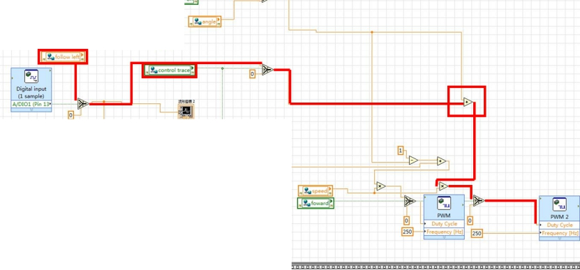 

<center><font size = 2>Figure 7. 寻迹功能转速控制逻辑框图</font></center>

​		寻迹功能的转速控制逻辑框图如图4所示，这里以左传感器控制右轮加速为例，主要关注红线标出的信号链路。

​		当传感器返回高电平“1”时，共享变量“follow left”的值就传到信号链路上。进而，当“control trace”为“1”时，共享变量“follow left”的值就会通过红色方框内的“+”运算和PWM波占空比的相乘系数加在一起。这个相乘系数与共享变量“speed”相乘，最终决定了右轮的转速。“follow left”的值设为正，这样系数会增大，从而右轮会加速。“follow left”的具体值通过实测确定，我们一般设置为0.1。

#### 3.3.3 反转控制逻辑

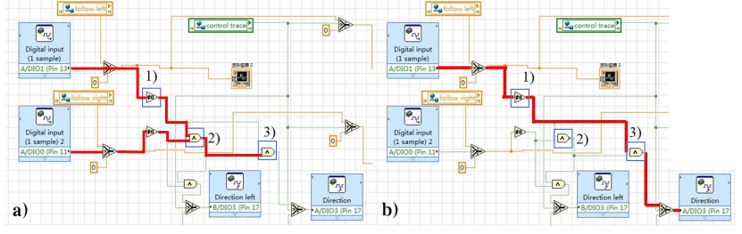 

<center><font size = 2>Figure 8. 寻迹功能的反转控制逻辑/font></center>

​		寻迹功能的反转控制逻辑框图如图5所示，仍以左轮的控制为例，关注红线标出的信号链路。

​		“非0”运算(1)将信号线上的数值转换为布尔值。当传感器数字输出端口返回高电平“1”时，“非0”运算(1)的输入端有正值，则输出端为布尔值1。

​		“与非”运算(2)有两个输入端，分别与左右车轮的“非0”运算(1)相连。当传感器数字输出端口都返回高电平“1”时，“与非”运算(2)的输出为布尔值0，否则都输出布尔值1。

​		“与”运算(3)有两个输入端，其中一个与“非0”运算(1)的输出相连，另一端与“与非”运算(2)的输出相连。

​		当只有一侧传感器返回高电平“1”时，“非0”运算(1)的输出为1，“与非”运算(2)的输出为1，“与”运算(3)的输出为布尔值1，车轮反转。这对应的是小车面对普通弯道的情况，这种情况下小车单轮反转，利用差速使小车旋向与轨迹方向相同。

​		当两侧传感器都返回高电平“1”时，“与非”运算(2)的输出为0，“与”运算(3)的输出为布尔值0，车轮正转，向前行走。这对应的是小车面对交叉路口的情况，这种情况下小车继续向前行走。下图是反转控制逻辑的真值表：

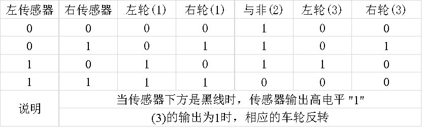

### 3.4 问题 & 说明

​		本节介绍我们在设计与调试过程中遇到的问题和优越性，并展示我们的实验成果。

#### 3.4.1 遇到的问题

​		我们遇到的问题主要有两个：

- 差速不够，在较急的弯道处无法顺利转向

- 叉路口不能正常前进

​		对问题1，我们对控制逻辑进行改进，从只控制单轮减速到控制另一轮加速，再到控制单侧轮反转，逐渐提高了差速，使得小车面对较急的弯道也能够顺利转向。

​		对问题2，我们针对两传感器都检测到黑线的情况添加了额外的逻辑运算，使小车在这种情况下车轮依旧正转，通过交叉路口。

#### 3.4.2 优越性

​		相比其他小组，我们的小车运行较快，分析原因如下：

- 在单轮反转时，我们同时控制另一车轮加速，一方面增大差速便于小车转向，另一方面也提高了转向速度；

- 在未检测到黑线时，我们没有刻意降低小车的速度；

- 在遇到交叉路口时，按照我们的控制逻辑，小车会加速度过交叉路口，提高了小车的平均速度。

### 3.5.1 结果简要展示

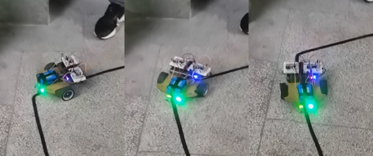

<center><font size = 2>Figure 9. 小车顺利通过弯道</font></center>

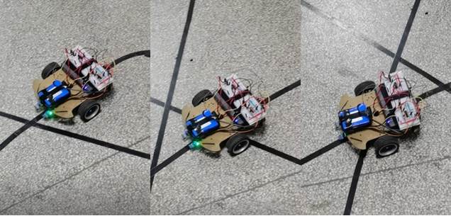

<center><font size = 2>Figure 10. 小车顺利通过弯道</font></center>

​		如图6、图7所示，我们的小车能够顺利通过弯道和交叉路口，完成实验目标。

---

## IV.超声避障模块

### 4.1 硬件原理 & 电路连接

​		实验开始使用的是一个五引脚的超声传感器（没有对应的舵机舵臂安装口的一种），个人猜测是HC-SR05，但是由于之后使用的是HC-SR04（4引脚），故以4引脚为例说明。四个引脚的作用分别是：

<table>
    <tr>
        <td>Vcc: 5V供电引脚</td>
        <td rowspan="4"><center>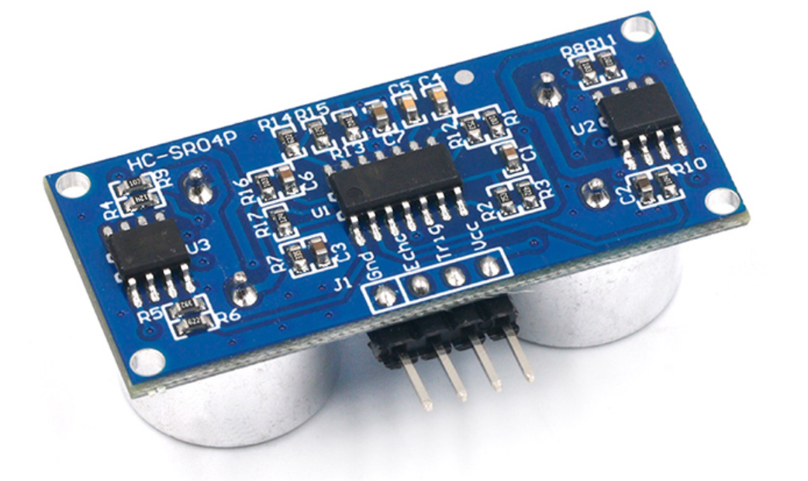</center></td>
    </tr>
  	<tr>
    	<td>Trig：超声触发信号</td>
  	</tr>
    <tr>
    	<td>Echo：模拟回波信号</td>
  	</tr>
    <tr>
    	<td>GND：接地</td>
  	</tr>
</table>


​		则可以知道，Vcc / GND只需要连接MyRIO对应的Vcc / GND即可，而Trig可以连接一个数字输出端口，Echo则需要连接一个模拟输入端口。此模块的触发原理如下：

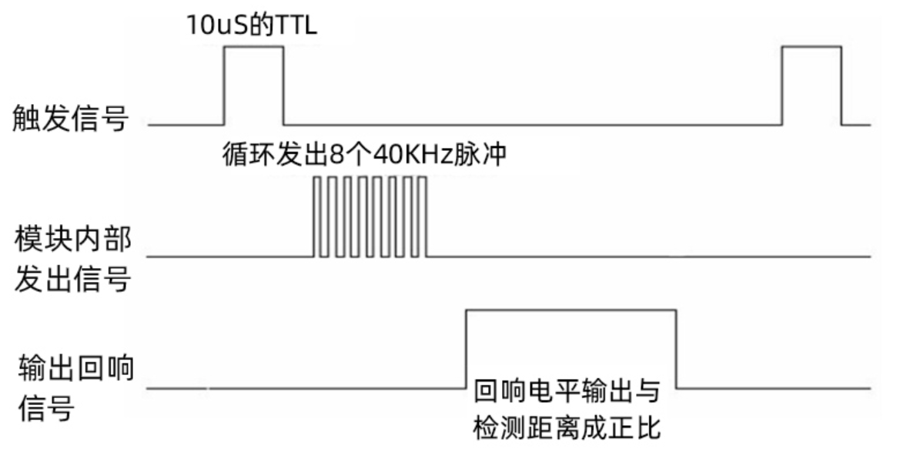

<center><font size = 2>Figure 11. 超声传感器硬件触发原理叙述</font></center>

- 首先需要数字输出端口输出一个至少10us的高电平脉冲。
- 内部模块接受这个脉冲后，发送几个高频脉冲（超声波）
- 另一个接收口接收回波，送给模拟输入端口

### 4.2 逻辑说明

#### 4.2.1 超声波发生

​		此处我们设计了一个子VI，由于这个模块需要重用并且存在一个层叠的顺序结构。此前我们发现，很多同学的实现直接使用了MyRIO的PWM输出模块，我们小组在经过思考之后认为这是不行的。因为PWM波是固定频率的，不会等待信号执行或是其他函数 / 控制的执行，也就是可能出现：

> - 没有回波超时保护，没有接收到回波就发送下一个导致控制信号混叠
> - 发送频率过高，没有执行对应的控制逻辑就进行下一次检测

​		所以我们自己设计了一个发生模块，主要由以下四部分组成：

<h5>层叠式结构第一步 Trig信号发生</h5>

| .png) | .png) | .png) | .png) |
| :--------------------------------------------: | :--------------------------------------------: | :--------------------------------------------: | :--------------------------------------------: |
|                     Step 1                     |                     Step 2                     |                     Step 3                     |                     Step 4                     |

​		存在四步：

- 第一步：首先需要将Trig输出（A Pin3）设为低电平
- 第二步：设置Trig为高电平（脉冲开始）
- 第三步：等待一定时间（10us）满足建立时间
- 第四步：设置Trig回到低电平，完成Trig信号生成

<h5>层叠式结构第二步 等待信号发送</h5>

.png)

<center><font size = 2>Figure 12. 层叠式结构第二步 等待信号发送</font></center>

​		超声发出存在8个40KHz的，等待这段时间之后可以开始进行超声信号接收计时。如果提早计时，则可能导致超声传感器计时过长，导致距离测算结果偏大。

<h5>层叠式结构第三步 信号计时</h5>

.png)

<center><font size = 2>Figure 13. 层叠式结构第三步 信号计时</font></center>

​		使用一个顺序结构，首先开始计时。

​		第二个框内是超时保护，假设受到回波的时间过长，不会卡在回波检测循环内导致之后的超声Trig信号生成不再进行，超时保护也就决定了过长的距离是无法检测的。

​		第三个框内做的事情是确定受到回波的时间，由于循环的退出方式除了超时退出之外，还有Echo高电平（收到回波），可以记录高电平来临时间。根据公式进行计算距离，最后进行输出的滤波。

#### 4.2.2 障碍检测逻辑

​		.png)

<center><font size = 2>Figure 14. 超声障碍检测模块的主函数</font></center>

​		首先初始化时需要设置两轮正转（向前走，初始状态）。此后进入顺序结构第二步，第二步直接只看顺序结构即可。首先调用了子VI，并且在前面板上进行可视化，并使用distance这个共享变量输出到远程终端上进行显示。

​		此后的逻辑是：

| 图片                                                         | 逻辑说明                                                     |
| ------------------------------------------------------------ | ------------------------------------------------------------ |
|  | 子VI的测距结果输入之后，输入到一个大小判定处。此下有两个共享变量：<br>(1) manual (布尔变量)，远程可以控制小车舵机手动转动，当然也可以超声程序进行自动转动。手动转动开启时（一般在小车卡在奇异位置时），可以手动检测障碍。<br>(2)threshold (模拟量)：距离阈值。小于此阈值之后会进行超声障碍检测。手动控制时设置为100（很大，总是超声障碍检测） |

​		此后：真（距离大于阈值），说明舵机**<u>指向前方</u>**时，障碍物距离比较远，可以继续直行。则沿用遥控模块。如果假（正前方遇到障碍物），则进入障碍逻辑。

#### 4.2.3 障碍规避逻辑

.png)

<center><font size = 2>Figure 15. 超声检测障碍规避（假逻辑）</font></center>

​		已经切换到假，由于是层叠顺序结构，不方便显示，直接用子图显示出来。首先：

- PWM8 / PWM9 占空比设为0（直接停车）
- PWM10（舵机），输出占空比为0.11的PWM波，舵机逆时针旋转，超声传感器看向左边。
- 等待350ms以等待舵机转到对应位置。
- 此后：见下图（外层层叠结构Step 0，内层Steps）

| -1624037389054.png) | .png) | .png) | .png) |
| :--------------------------------------------: | :----------------------------------------------: | :-------------------------------: | :-------------------------------: |
|                     Step 0                     |                      Step 1                      |              Step 2               |              Step 3               |

- 首先重用子VI重新检测左边距离，保存在局部变量中
- 此后，输出占空比为0.04的PWM波，舵机顺时针旋转，超声传感器指向右边
- 重用子VI重新检测右边距离，保存在局部变量中
- 舵机回中，超声传感器指向前方

| .png) | .png) |
| :----------------------------------------------: | :----------------------------------------------: |
|                外层层叠结构Step 1                |                外层层叠结构Step 2                |

​		Step1: 比较左右局部变量保存的距离，左边还是右边的距离大（宽裕）？左图显示假的情况：即右边的距离大，应该让车右转（控制D0，左轮右轮相反）。spin time是一个模拟的共享变量，远程可以根据旋转时间控制避障时旋转的时间。

​		Step2：已经完成了转向，两轮保持向前转动。

### 4.3 问题 & 说明

#### 4.3.1 遇到的问题

​		遇到最扯的问题就是：与非门的问题，那天实验查了一上午才查出来问题。问题描述：

> 突然小车某个轮子不受控制，调速无效。

​		好在我们有示波器，我们测了：电机驱动模块是否有用 / 与非门是否有PWM波信号输出，占空比是否正确，调换了电机驱动模块，更换了电池，**<u>均无效</u>**。最后突然发现：

- 左轮（正常的轮子）PWM波的幅值是4.4V左右（MyRIO 5V供电）
- 右轮（有问题的轮子）PWM波的幅值只有3.8V左右。于是我们觉得是与非门突然坏掉了，更换之后果然好了。

#### 4.3.2 优越性

​		我们的小车避障行驶过程很快速（事实上我们的小车几个模块都有“快速”的特点）。原因：

- 有些组使用舵机一直左右摆动的方法进行避障，但是这无法避免运动畸变导致的控制不稳。
- 另一些组的控制逻辑不够完备：无障碍直行逻辑，停等左右查询逻辑做不到快速。
- 我们只需要花费700ms就可以完成一轮左右查询 + 决策，大多数情况下都是可以直行的。

### 4.4 结果简要展示

| 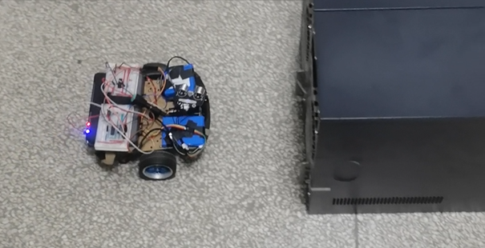 | 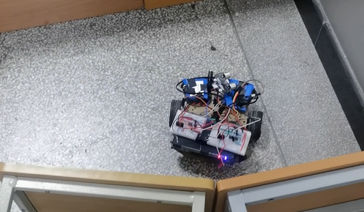 |
| :------------------: | :---------------------------------------------: |
|    双通道障碍寻路    |                 死胡同障碍逃脱                  |

---

## V.附加-人脸跟踪

### 5.1 硬件原理 & 电路连接

​		实验中，我们使用了一个附加的OpenMV模块进行人脸识别 / 跟踪算法的前端。

> 它是一个可编程的摄像头，通过MicroPython语言，可以实现你的逻辑。
> 而且摄像头本身内置了一些图像处理算法，很容易使用。

​		本实验使用到相关的部分有：

<table>
    <tr>
        <td>P6（OpenMV唯一的DAC输出）</td>
        <td rowspan="4"><center></center></td>
    </tr>
  	<tr>
    	<td>VIN：3.3V-5V供电口</td>
  	</tr>
    <tr>
    	<td>GND：接地</td>
  	</tr>
    <tr>
    	<td>内置代码接口，可以直接调内部库实现功能</td>
  	</tr>
</table>

### 5.2 逻辑说明

#### 5.2.1 OpenMV端

​		OpenMV实现了以下的主要功能：

- 摄像头取流，灰度化
- 使用Haar特征子，在图像上求解人脸Haar特征（Haar特征是传统人脸识别最常用的一个特征子）

- 使用级联分类器（Cascade classifier）对多个ROI（感兴趣区域）进行分类，最后得到最可能是人脸的几个区域
- 对于人脸区域，返回一个框选矩形
- Python实现PID，控制目标是使得人脸框的中点位于图像的中间位置

​		逻辑就结合代码以及 **<u>代码注释</u>** 过一遍。

```python
#人脸识别开关
import sensor, time, image #导入模块
from pyb import LED        #导入模块
from pyb import DAC        # DAC

# 设定图像基本参数
sensor.reset()       #初始化摄像头
sensor.set_contrast(2) #亮度－3至3
sensor.set_gainceiling(2)  #增益
sensor.set_framesize(sensor.QVGA)  #图像格式
sensor.set_pixformat(sensor.GRAYSCALE) #灰度


# 跳过起始的不稳定帧（2s内）
sensor.skip_frames(time = 2000)

# 加载内部的Haar级联分类器
# stages是相当于是级联的阶段数，越大越慢但是越准确
face_cascade = image.HaarCascade("frontalface", stages=25)  #特征点25个

# DAC模拟输出模块初始化，12表示模拟输出精度（12位，也就是4096个不同的模拟值）
dac = DAC("P6", 12)
# PID控制参考输入：电压需要控制到1.6V
volume_ref = 1.6

# PID模块：但是没有调参，因为发现只需要P调节完全可以做到（控制频率本身很低，而且无法衡量稳态误差）
class PID:
    def __init__(self, ref):
        self.old_err = 0.0
        self.inte = 0.0
        self.pk = 0.1
        self.pi = 0.0
        self.pd = 0.0
        self.ref = ref
	# PID主逻辑
    def pidControl(self, x):
        err = x - self.ref
        diff = err - self.old_err
        self.inte += err
        return self.pk * err + self.pi * self.inte + self.pd * diff

pid = PID(0.5)
# 取流循环，取图像找人脸
while (True):
    img = sensor.snapshot()
    # 过级联分类器，寻找人脸Haar特征，返回框选矩形
    objects = img.find_features(face_cascade, threshold=0.5, scale_factor=1.4)
    if objects:
        # 在图像上绘制出选框来
        img.draw_rectangle(objects[0])
        x, y, w, h = objects[0]
        # 求选框的中心 尤其是cx（横坐标）
        cx = x + w / 2.0
        cy = y + h / 2.0
        # 由于希望横坐标尽可能接近图像中心，所以需要使用PID，首先归一化输入到[0，1]区间
        voltage = (cx - img.width() / 2) / img.width() * 1 + 0.5
        out = pid.pidControl(voltage)
        voltage += out
        # 输出结果需要限定范围
        voltage = min(max(voltage, 0), 1)
        # DAC输出[0,4095],需要变换以下
        output = int(voltage * 4096)
        print(voltage, out)
        dac.write(output)
        # LED控制，如果人脸在图像右半边，则亮红灯，反之亮绿灯，如果未检测到人脸，不亮灯
        if cx >= img.width() / 2.0:
            LED(2).on()
            LED(1).off()
        else:
            LED(1).on()
            LED(2).off()
    else:
        dac.write(int(0.5 * 4096))
        LED(2).off()
        LED(1).off()
```

#### 5.2.2 MyRIO端

​		MyRIO此处做的事情非常简单，因为大多数信息都在OpenMV端进行了计算，MyRIO只需要接收一个模拟量用以控制轮速以及轮子转动方向即可。我们的控制程序框图如下：


<center><font size = 2>Figure 16. 人脸跟踪逻辑</font></center>

​		实际上就是转向控制，我们的控制逻辑如下：

- 首先模拟输入端口输入OpenMV DAC信号，进行滤波（指数平均）：

$$
y(t)=0.1x(t)+0.9y(t-1)
$$

​		实际上是一个无限长冲击响应系统，等效为一个低通系统。

- 归一化输入（除以共享变量half setter（模拟量）），使得输入是[0,1]去间内，并且0.5时对应着人脸在正前方。
- **<u>一方面</u>**：模拟量直接给PWM占空比输出，控制占空比（左右两轮速度调节，方法与遥控是一致的）
- 另一方面：模拟量判定大小：
  - 如果大于0.52（应该是向右转），需要使得右轮反转
  - 小于0.48（应该是向左转），需要使得左轮反转
  - [0.48, 0.52]区间内，近似直行，小车两轮正转，直接向前走
- 模拟量判断大小有两层嵌套的条件结构实现。

### 5.3 遇到的问题

​		不建议使用OpenMV做人脸跟踪。因为OpenMV的分辨率太低，可以调整为VGA（画幅变大），但是感觉OpenMV画幅变大是插值插出来的，根本不是原图。大画幅非常模糊。所以对远距离人脸效果不会有树莓派外接USB Cam好用。

​		主要问题就在于：**<u>OpenMV</u>**人脸识别对于环境光不鲁棒。人脸需要非常亮，而且光照均匀才能被才能很好地被识别出来，否则就一直掉帧，控制频率极其低。所以实验过程中基本上是，一人拿着手机手电自己给自己打光，另一个人录像，还有一个人控制一下前面板。

### 5.4 结果简要展示

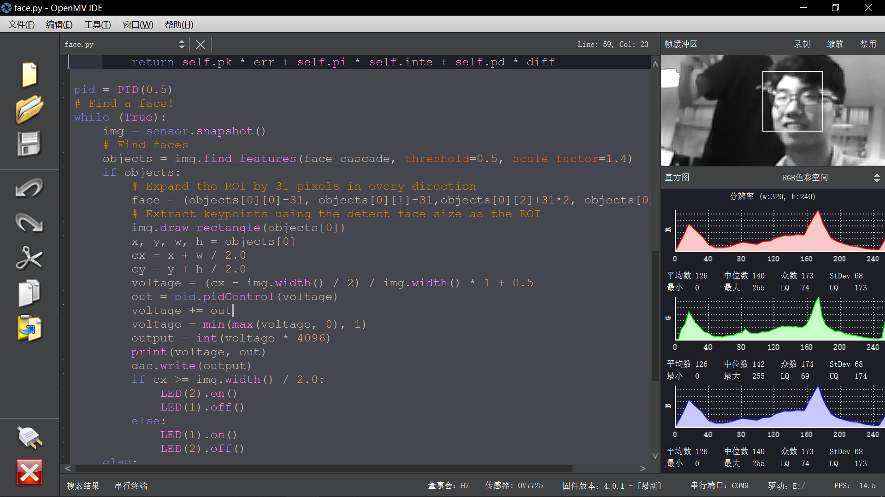

<center><font size = 2>Figure 17. OpenMV IDE显示画面</font></center>

​		实际跟踪效果如下（详细见视频）。开始时实现的是在桌面上跟随人脸转动，无法很好地前进（没有前进逻辑）。此后补上了前进逻辑（模拟输入存在一个范围，此范围内前进）：

|  |  |
| :---------------------------------------------------------: | :---------------------------------------------------------: |
|                     人脸手动打光 寻人脸                     |                 OpenMV识别到人脸在右侧 亮灯                 |

---

